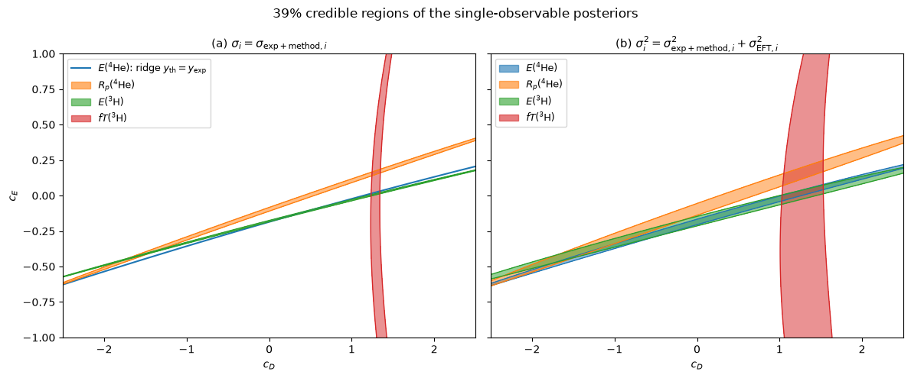
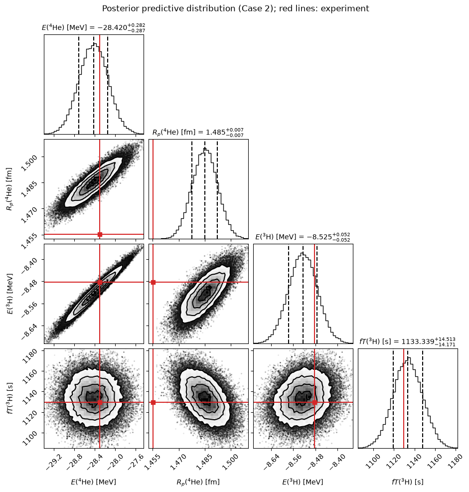
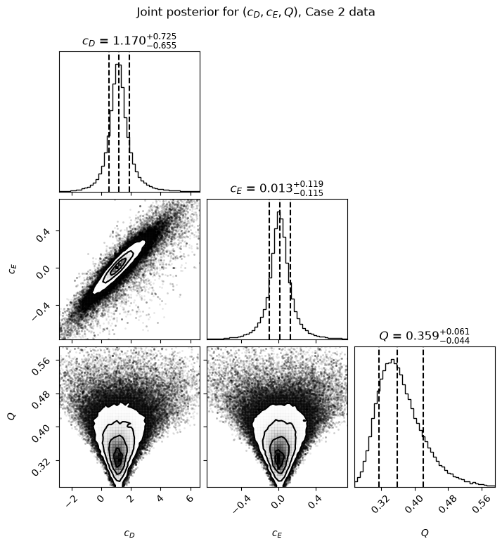

# Bayesian calibration of a nuclear physics model with MCMC

This project calibrates a physics model with unknown parameters against
experimental data. It infers the parameters with full uncertainty
quantification, includes the model's own systematic error, and checks that the
calibrated model is consistent with the measurements.

The model is a chiral effective field theory (EFT) description of light atomic
nuclei (³H, ³He, ⁴He). Its two free parameters, $c_D$ and $c_E$, control the
three-nucleon force. Solving the full model takes about a minute per
evaluation, which is too slow for statistical inference. The analysis therefore
uses an **emulator**, a reduced-order surrogate model that runs in about 60 µs.
That makes it possible to evaluate the model hundreds of thousands of times.

The full analysis, with code, figures and discussion, is in
**[`bayesian_eft_calibration.ipynb`](bayesian_eft_calibration.ipynb)**.

**Methods:** Bayesian inference · prior and posterior predictive checks ·
MCMC sampling (`emcee`) · convergence diagnostics · model-discrepancy modeling ·
hierarchical inference of an error-model parameter

**Tools:** Python · NumPy · SciPy · Matplotlib · emcee · corner · Jupyter

## The analysis

1. **Prior predictive check.** Draw parameters from the prior and push them
   through the model, to see what the prior implies for the observables.
2. **Information content of each observable.** Compute the posterior
   conditional on one observable at a time, on a grid, with and without a
   term for the EFT truncation error.
3. **MCMC sampling** of the posterior for two data sets. Convergence is
   checked with trace plots and integrated autocorrelation times, and runs are
   seeded so they are reproducible.
4. **Posterior predictive check.** Compare the predictions of the calibrated
   model with the experimental data.
5. **Learning the error model.** Sample the EFT expansion parameter $Q$, which
   sets the size of the model error, jointly with $c_D$ and $c_E$.

The workflow follows Sec. II of
[Wesolowski *et al.*, arXiv:2104.04441](https://arxiv.org/abs/2104.04441).
It uses a slightly different model and some extra approximations, so the
results are not meant to match the paper exactly.

## Key results

**A "vague" prior is not vague in observable space.** A prior that only says
the parameters are of natural size ($`\mathcal{N}(0, 5^2)`$) puts 38% of the
probability on a ⁴He nucleus that is bound more than three times as strongly as
the real one. The prior predictive spread is $`10^2`$ to $`10^5`$ times larger than
the experimental errors.

**Without the model error, the data are inconsistent.** Each observable alone
constrains only one combination of the parameters, which shows up as a band in
the $(c_D, c_E)$ plane. With experimental errors only (left panel), the four
bands do not meet in a common point. Once the EFT truncation error is included
(right panel), they do. The ³H beta decay ($fT$) is almost orthogonal to the
other observables, so it is the observable that breaks the degeneracy.



**Parameter estimates** (median and 68% credible interval, from 1.6–2.4 × 10⁵
MCMC samples):

| Data set | $c_D$ | $c_E$ | corr($c_D$, $c_E$) |
|---|---|---|---|
| E(⁴He), R<sub>p</sub>(⁴He) | $-1.68^{+2.33}_{-2.14}$ | $-0.47 \pm 0.41$ | 0.995 |
| E(⁴He), R<sub>p</sub>(⁴He), E(³H), fT(³H) | $1.17 \pm 0.47$ | $0.016 \pm 0.080$ | 0.936 |
| same, with $Q$ sampled | $1.17^{+0.73}_{-0.66}$ | $0.013^{+0.119}_{-0.115}$ | 0.899 |

With only the two ⁴He observables the parameters are almost perfectly
degenerate. Adding the ³H data constrains both of them.

**The calibrated model passes the posterior predictive check.** All four
observables are reproduced within 1.6 σ of the total (experimental + model)
uncertainty. The predictions are 31 to 836 times narrower than before the data
were included. The largest tension is the ⁴He radius.



**The data constrain the size of the model error.** When $Q$ is sampled, its
posterior (68% interval [0.32, 0.42]) is much narrower than its
Beta(3, 5) prior ([0.21, 0.55]) and peaks close to the value $Q = 0.33$ that
was assumed earlier. Marginalizing over $Q$ gives the parameter posterior heavy
tails, and its 95% interval for $c_D$ becomes more than twice as wide. The paper
reports the same effect.



## Repository structure

```
├── bayesian_eft_calibration.ipynb   # full analysis, with outputs
├── quantumsolver.py                 # emulator (provided by the course)
├── evcData/                         # emulator matrices (provided by the course)
├── figures/                         # figures used in this README
└── requirements.txt
```

## How to run

After cloning the repository:

```bash
python -m venv .venv
source .venv/bin/activate
pip install -r requirements.txt
jupyter notebook bayesian_eft_calibration.ipynb
```

`quantumsolver.py` and `evcData/` must be in the same directory as the
notebook. A full run takes about 3 minutes on a laptop. All random number
generators are seeded, so the results are reproducible. The notebook was tested
with Python 3.11, NumPy 2.4, SciPy 1.17, Matplotlib 3.11, emcee 3.1 and
corner 2.3.

## Credits

This was a course project in *Learning from Data* (TIF285), Chalmers University
of Technology, Fall 2026. The course provided the project description, the
physics background, the emulator `quantumsolver.py` (developed by Andreas
Ekström, Dept. of Physics, Chalmers) and the data in `evcData/`. The
implementation of the analysis, the figures and their interpretation are
original work.
